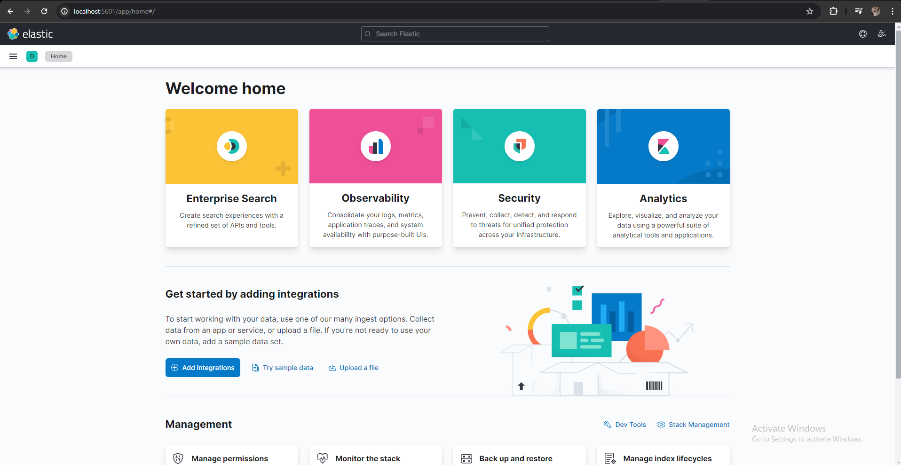
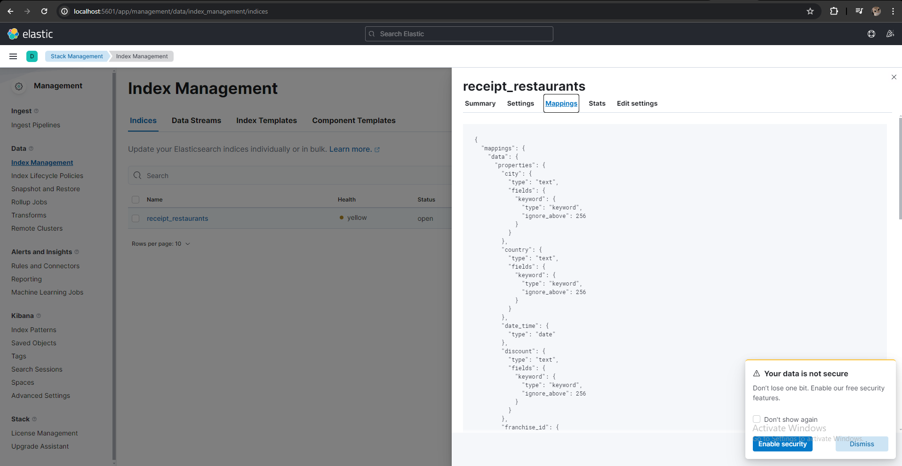
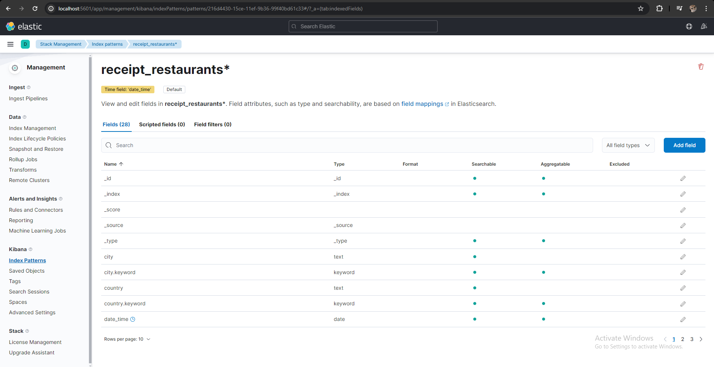
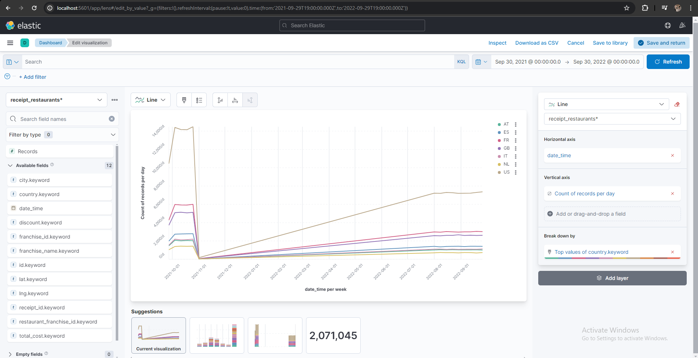
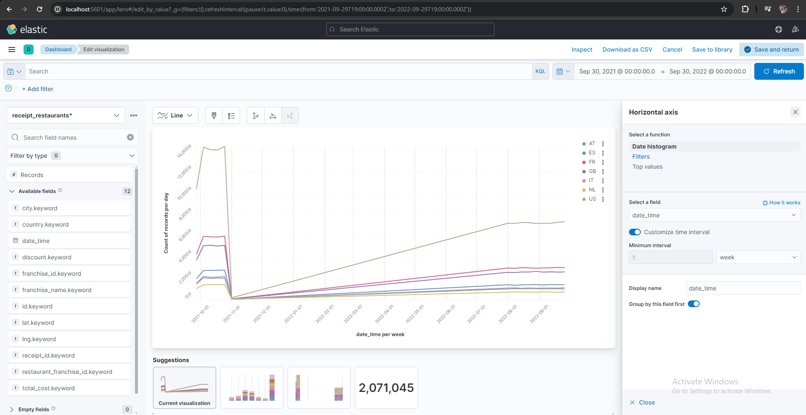
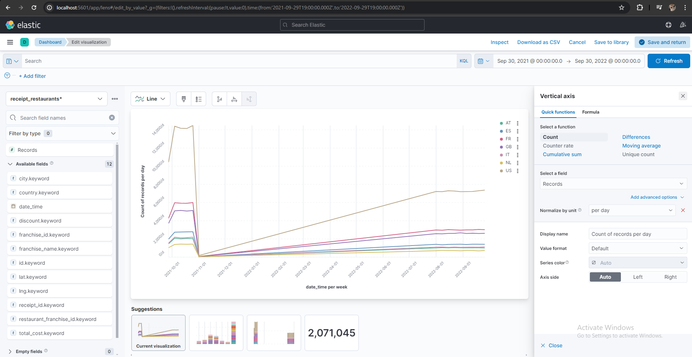
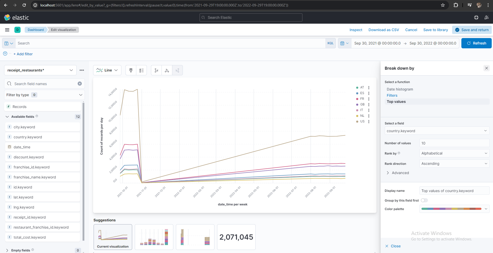
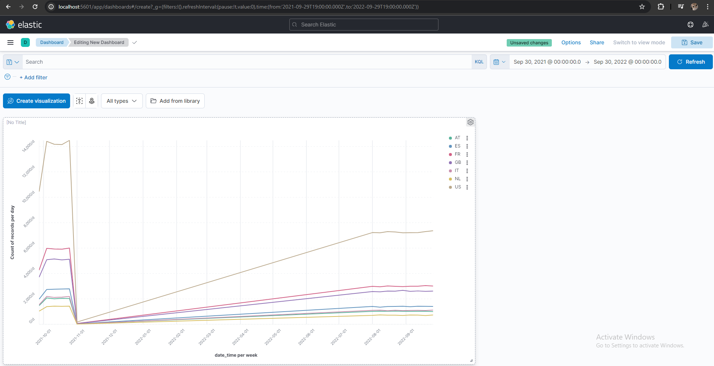

# Elasticsearch, Logstash, Kibana with Spark Streaming

This project sets up Elasticsearch, Logstash, and Kibana (ELK stack) using Docker Compose and uses a Spark Streaming job to read data from a dataset and publish it into Elasticsearch. The data is then visualized in Kibana.

## Components

- **Elasticsearch**: A highly scalable open-source full-text search and analytics engine. It allows you to store, search, and analyze big volumes of data quickly and in near real time.

- **Logstash**: An open source data collection engine with real-time pipelining capabilities. Logstash can dynamically unify data from disparate sources and normalize the data into destinations of your choice.

- **Kibana**: An open-source data visualization and exploration tool used for log and time-series analytics, application monitoring, and operational intelligence use cases. It offers powerful and easy-to-use features such as histograms, line graphs, pie charts, heat maps, and built-in geospatial support.

- **Spark Streaming Job**: A Spark application that reads data from a dataset and publishes it into Elasticsearch.

## Docker Compose

The [docker-compose.yml](compose.yaml) file defines the services that make up the ELK stack. It includes the following services:

- **Elasticsearch Service**: Runs an Elasticsearch instance. The environment variables and Java options are set to ensure that Elasticsearch runs in a single-node cluster mode and with a heap size of 512MB.

- **Logstash Service**: Runs a Logstash instance. It depends on the Elasticsearch service, meaning it will start after the Elasticsearch service is up.

- **Kibana Service**: Runs a Kibana instance. It depends on the Elasticsearch service.

## Spark Streaming Job

The [SparkJavaElasticStreamTest](src/main/java/biz/svyatoslav/learning/bigdata/elasticsearch/SparkJavaElasticStreamTest.java) Java class is a Spark Streaming job that reads data from a [dataset](dataset) and publishes it into Elasticsearch. It connects to Elasticsearch, prepares the data, and writes the data into an Elasticsearch index.
The result of execution can be found in [execution-logs](execution-logs.txt)

## Kibana Dashboard

The Kibana dashboard shows restaurants by country on a line chart. The X-axis represents the time field of the data, and the Y-axis represents the count of the documents in the Elasticsearch index that match the given time interval on the x-axis. Each line in the chart represents a country.

### Kibana Line Chart Description

The line chart created in Kibana visualizes the count of restaurants by country over time. Here are the main components of the chart:

- **X-Axis (Time)**: The X-axis represents the time field of the data, which is the 'date_time' field in this case. The values are displayed as a Date Histogram, which means the data is divided into time intervals, and the count of documents is calculated for each interval.

- **Y-Axis (Count)**: The Y-axis represents the count of the documents in the Elasticsearch index that match the given time interval on the x-axis. In other words, it shows the number of restaurants for each time interval.

- **Lines (Countries)**: Each line in the chart represents a country. The height of the line at any point on the x-axis represents the count of restaurants in that country at that specific time. This allows you to compare the number of restaurants between different countries over time.

- **Legend**: The legend shows the color coding for each country. You can click on the country names in the legend to hide or show them on the chart. This can be useful if you want to focus on specific countries.

Remember, this is a basic line chart and Kibana offers many other options and features that you can explore to customize your visualizations.

## Visuals

</img>
</img>
</img>
</img>
</img>
</img>
</img>
</img>
